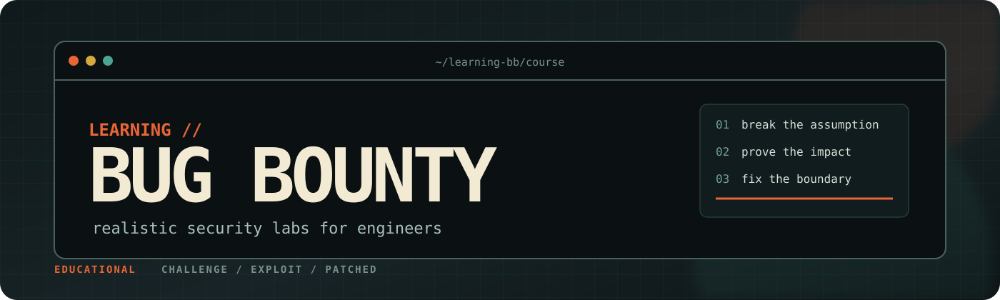

# learning-bb

<p align="center">
  
</p>

> **Educational security lab.** This repository contains deliberately vulnerable
> applications for learning how web-security failures arise, how investigators
> demonstrate their impact, and how engineers remove the underlying trust-boundary
> mistake.

Independent bug-bounty lessons built around small, believable products. Each
runnable case separates the target, investigation, and corrected implementation.

The course is designed for engineers: each case connects an attacker objective to
a concrete product consequence, then shows the corresponding defensive design.
The included targets use planted accounts, data, secrets, and state so the proofs
remain self-contained.

```bash
uv sync
cd 06-idor/case-01-support-tickets
uv run python challenge/app.py   # terminal 1
uv run python exploit/solve.py   # terminal 2
```

Lessons `00-01` cover workflow; `02-17` mirror the book's vulnerability track;
`18-21` cover expert techniques; `22-26` add important modern web topics.

## Case structure

```text
case-name/
  challenge/app.py   # target; no /vuln route and no embedded fix
  exploit/solve.py   # baseline, hypothesis test, evidence, impact
  patched/app.py     # separate root-cause correction
```

Start with the topic README and challenge. Avoid opening `exploit/` or `patched/`
until you have mapped the feature and attempted a manual proof in your proxy.

See [COURSE-METHOD.md](COURSE-METHOD.md) for the investigation loop.
